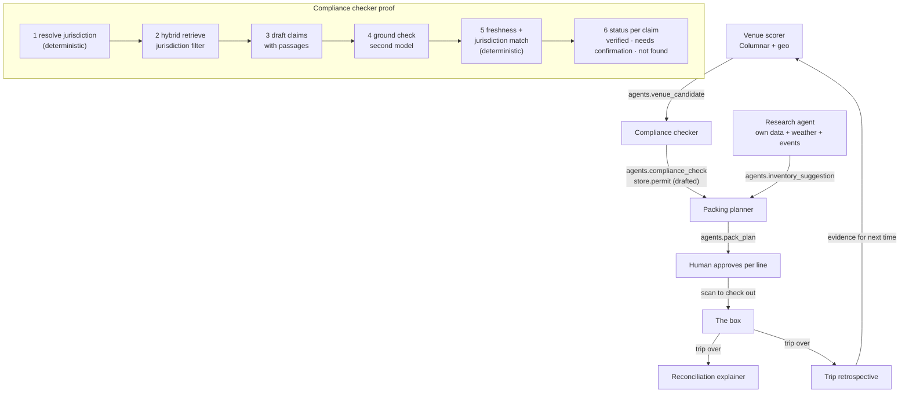

# Agents and evaluation: the compliance checker and its proof

Four planning agents run in Capella before a trip: a venue scorer, a compliance checker, a research agent for
inventory, and a packing planner. Three run on the box during it: the clerk copilot, the upsell reason line and
the evening briefing. Two run in Capella after it: the reconciliation explainer and the trip retrospective. None
of them calls another. Each reads documents and writes documents, with evidence attached to every claim, and a
human or a rule disposes of what it proposed. The compliance checker is the centrepiece because it is the one
where a confident wrong answer costs real money, so it is the one that proves its work.



## How Store in a Box uses it

**The agent output contract.** Every agent output is a document with: the ids of the inputs it read, the model
and prompt version (from Agent Catalog), a list of claims or recommendations each with `evidence[]` and a
`status`, and a `review` block the human fills in (accepted, rejected, edited, by whom, when). The review block
is the evaluation signal for every agent that does not have a gold set. Agents are fenced: the packing agent does
not create allocations, accepting its plan does; the compliance agent does not file, see
[permit-flow](permit-flow.md); the pricing agent does not change prices, approving its proposal does.

**The compliance checker's pipeline.**

1. **Resolve the jurisdiction** deterministically from the venue's coordinates: state, county, city, special tax
   districts. This is a hard filter for everything after it, and it is what catches Richmond, Virginia against
   Richmond, California, which a name match would not.
2. **Retrieve** from `ref.ordinance` with Capella Search hybrid retrieval: jurisdiction as a filter, semantic over
   the question. Each chunk carries its source URL, retrieval date and, where known, the ordinance's last-amended
   date.
3. **Draft** one claim per requirement: fee, lead time, where to apply, and the passage it came from.
4. **Ground check.** A second pass, different prompt and ideally a different model, takes each (claim, passage) pair
   and answers one question: does the passage support the claim? Yes, partially, no.
5. **Deterministic checks.** Freshness: is the retrieval newer than the last amendment? Jurisdiction: does the
   passage's jurisdiction id equal the resolved one? Not the name. The id.
6. **Status.** `verified` if all pass. `needs_confirmation` if any fails, naming which one. `not_found` if
   retrieval returned nothing relevant, said plainly rather than guessed. Never a bare percentage.

Each claim is written with its evidence in the same document:

```json
{ "claim": "Transient vendor licence required; $75; 10 business days",
  "status": "needs_confirmation",
  "checks": { "grounded": true, "fresh": false, "jurisdiction_match": true },
  "evidence": [{ "source_url": "...", "quoted_passage": "...", "retrieved_at": "2026-09-30",
                 "jurisdiction": "us-va-richmond-city", "last_amended": "2026-10-01" }],
  "confirmed_by": null }
```

The summary line per site reads "4 verified, 1 needs confirmation (tent rule: source older than last amendment),
0 not found. Feasible pending confirmation." That is what the venue scorer's shortlist shows.

**Poison the corpus on stage.** Before the demo, one chunk in `ref.ordinance` is given a wrong fee and a wrong
jurisdiction label. The agent runs live and the claim comes out `needs_confirmation` with the failing check named.
Showing an agent catch its own source is worth more than showing one that is always sure.

**Confirmation is a source.** When a clerk confirms a `needs_confirmation` claim by calling the county from the
venue, the answer is written as a `confirmation` document in `ref.ordinance` with who, when and how. The agent
reads it on its next run. The knowledge base improves per trip, and the confirmation can be recorded on the box
offline. See [permit-flow](permit-flow.md).

**Gold set and eval runs.** `ref.gold_site` holds twenty sites with known-correct checklists. An eval run executes
the agent against all twenty and writes one `agents.eval_run` document: model, prompt version, claim-level
precision and recall, count of false `verified`, run time. One chart over `eval_run` shows accuracy across
versions. The ship rule is simple: false `verified` must be zero. The eval harness is just more documents and a
query.

**The other agents, briefly.** The venue scorer blends past trips, loyalty density, online ship-to addresses,
events and weather in Columnar and writes five candidates with reasons. The research agent reads the retailer's
own signals (reviews, searches by geography, wishlists, past "asked for, didn't have") plus weather and the event
calendar, with social feeds optional and labelled, and writes suggestions with evidence; accept/decline on each is
its eval. The packing planner reads all three and writes a pick list the human approves per line. The explainer
and the retrospective read the trip and write narratives, and the retrospective is evidence for the next scorer
run. On the box, the copilot, the upsell reason line and the briefing run against a small model with local
queries as tools and degrade to nothing when the box is off, which is fine because the register does not need
them.

## Talking points

- "Every claim has the passage it came from, the date we read it, and three checks. Click it on the tablet."
- "I poisoned a source before we started. Watch it get caught."
- "Not found is an answer. An agent that always finds something is lying some of the time."
- "The clerk called the county. That phone call is now a source the agent reads next time."
- "Twenty sites with known answers, one document per run, one chart. Zero false verifieds or the prompt does
  not ship."

## Possible enhancements

- Per-jurisdiction permit templates the agent fills, replacing free-form applications.
- **Couchbase AI Data Plane (possible, not in the demo).** Agent Catalog could hold every agent's tools (the
  conservation query as a `.sqlpp` tool, HQ's API as an OpenAPI tool, the ordinances as a semantic-search tool) and
  prompts, versioned with git, so each output carries the exact versions; Agent Tracer would show which tools the
  compliance agent called. A semantic cache in front of compliance questions must key on the jurisdiction, so one
  Richmond never answers for the other, and a cached claim still passes the freshness and jurisdiction checks.
  See [ai-data-plane](ai-data-plane.md) (R1, R4, R7).
- Social signal as a first-class research input once platform access and cost are settled.
- A fleet dispatcher once there is more than one box.
- Shrinkage patterns across trips, as suggestions with evidence, never accusations.

## Alternatives and trade-offs

| Option | Trade-off |
|---|---|
| **Agents calling agents over APIs** | Nothing runs offline, the audit trail is a second system, and the on-box agents cannot take part. Documents as the bus make the box a peer. |
| **One big agent** | One prompt, one failure mode, no boundary between "plan the trip" and "approve the permit." Fencing needs the seams. |
| **Confidence as a percentage** | Reads as precision and is not. Three named checks and three states tell the office what to do next. |
| **Trust the retrieval** | The Richmond problem. A name match is not a jurisdiction match, and a stale chunk is not a current rule. The deterministic checks are cheap and catch both. |
| **Skip the gold set** | The agent still works, and nobody can say whether the new prompt made it better or worse. |

Related: [permit-flow](permit-flow.md) · [capella-reconcile](capella-reconcile.md) ·
[hybrid-upsell](hybrid-upsell.md) · [edge-server-box](edge-server-box.md)
