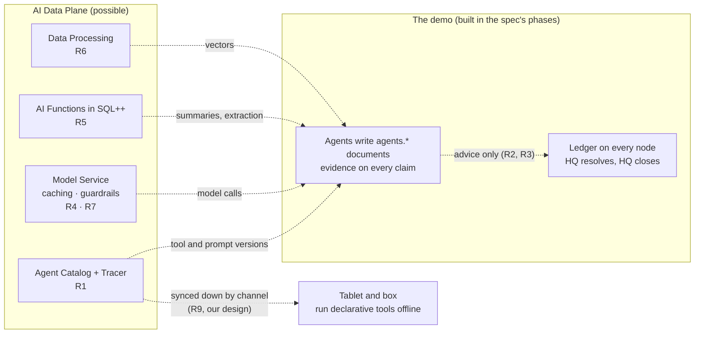

# The Couchbase AI Data Plane: possibilities, not the demo

Everything in this note is a possibility. None of it is built, none of it is in any phase's acceptance criteria, and
the demo works without all of it. It records what the Couchbase AI Data Plane could add to Store in a Box, which beat
each idea would strengthen, and the rule that keeps each one inside the ledger's authority and provenance rules. The
ideas, their facts and their sources are kept in [`docs/ROADMAP.md`](../ROADMAP.md) (R1 to R9), where the architect
picks them up when the budget allows; this note is the design reading of them.

The demo runs on Capella. The spec names the cloud-side AI "Capella AI Services" and plans cloud model calls and
embeddings for the agents, and Phase 3's scope names Agent Catalog for the planning agents' tool definitions. The AI
Data Plane is that product's current name. The items below go further than the spec does; where one overlaps it (R1
and Phase 3's Agent Catalog), the overlap is said.

## What the AI Data Plane is

Facts checked against Couchbase's documentation on 2026-10-09. The AI Data Plane is offered fully managed on Capella
or self-managed with Couchbase Server Enterprise Edition
([AI Data Plane overview](https://docs.couchbase.com/ai/get-started/intro.html)). Its parts:

| Part | What it is | Availability |
|---|---|---|
| Model Service | Deployed LLMs and embedding models, or OpenAI and Amazon Bedrock models. Per deployment: standard caching (exact prompt and parameters), semantic caching (needs a deployed embedding model; a score threshold sets how close a match must be), the `X-cb-cache` header to choose `standard`, `semantic` or `none` per request, a cache TTL (default 4,000 s, from 3,600 to 604,800), async processing, guardrails, jailbreak detection and up to 10 filtered keywords ([Configure caching](https://docs.couchbase.com/ai/build/model-service/configure-value-adds.html), [Deploy an LLM](https://docs.couchbase.com/ai/build/model-service/deploy-llm-model.html)). | Enterprise support only ([AI Data Plane overview](https://docs.couchbase.com/ai/get-started/intro.html)). |
| AI Functions | SQL++ functions: `ai_summary`, `ai_classification`, `ai_extraction`, `ai_sentiment`, `ai_masked`, `ai_translation`, `ai_similarity`, `ai_corrected_grammar`, `ai_generated_text`, `ai_completion`, backed by a Model Service model, OpenAI or Bedrock ([AI Functions](https://docs.couchbase.com/ai/build/ai-functions.html)). | On Capella: a paid operational cluster on Couchbase Server 8.0 or later, multiple availability zones, Developer Pro or Enterprise support ([AI Functions](https://docs.couchbase.com/ai/build/ai-functions.html)). |
| Data Processing | Workflows you create and run over data already in a Capella cluster, or PDFs, images and JSON in S3; up to 100 MB per file and 10,000 files per workflow. You stop and re-run a workflow, and each one creates two Eventing functions on the cluster; the page does not say whether documents written after a run starts are vectorized ([Data Processing](https://docs.couchbase.com/ai/build/vectorization-service/data-processing.html)). | Enterprise support only ([AI Data Plane overview](https://docs.couchbase.com/ai/get-started/intro.html)). |
| Agent Catalog | A versioned store of an agent's tools and prompts, with git as the version source. Not an agent framework: your framework runs the tools. Tools are Python functions, `.sqlpp` files with a YAML header, YAML semantic-search tools and YAML HTTP tools over an OpenAPI spec; prompts are `.prompt` files. The `agentc` CLI indexes them into local JSON under `.agent-catalog` and publishes them to an `agent_catalog` scope. Helpers for LangChain, LangGraph and LlamaIndex ([Agent Catalog](https://docs.couchbase.com/ai/build/integrate-agent-with-catalog.html)). | Not marked Enterprise-only on the overview ([AI Data Plane overview](https://docs.couchbase.com/ai/get-started/intro.html)). |
| Agent Tracer | A record of agent activity: tool calls, results and model outputs, logged to `./agent-activity` by default ([Agent Catalog](https://docs.couchbase.com/ai/build/integrate-agent-with-catalog.html)). | Not a core feature on the overview, which names it under building an agent. |
| Agent Memory | Persistent per-user memory across sessions. | Enterprise support only ([AI Data Plane overview](https://docs.couchbase.com/ai/get-started/intro.html)). |
| MCP Server | A self-hosted MCP server for SQL++ queries, schema listing and document reads and writes, with a read-only mode that is not the default. | Recorded in fieldproof's reference (checked 2026-09-24), not re-checked here. |

## The possibilities, beat by beat

Each item names the beat in `docs/SPEC.md` it would strengthen and the guard that keeps it inside the rules the demo
already has: the agent output contract (spec sections 4.6 and 6.1: inputs, model and prompt version, evidence and status on
every claim, a review block), fencing (agents propose, humans and rules dispose), HQ as the authority that settles
(decision [007](../decisions/007-hq-settles-tentative-until-close.md)) and HQ's clock ordering HQ's decisions
(decision [008](../decisions/008-hq-clock-orders-decisions-foreign-movements-flagged.md)).

### R1. Agent Catalog as the single source of the agents' tools and prompts

**Beats 1 to 3** (venue scorer, compliance agent, research agent) and, if the catalog reaches the box, beat 6.
Phase 3's scope already has Agent Catalog for the planning agents' tool definitions; this goes further. Every
agent's tools and prompts are versioned in the database, and every agent output is stamped with the exact tool
and prompt version, which is the "model and prompt version" the output contract already asks for. Tools to
catalogue: the conservation query and the exception queue as `.sqlpp` tools; HQ's HTTP API (`ports/hq.md`) and the
box agent's API (`ports/box-agent.md`) as OpenAPI tools; the ordinances as a semantic-search tool over a vector
index. Agent Tracer is the "show its work" beat: which tools the compliance agent called, with what, and what came
back.

**Guard.** The catalog versions definitions; it does not change what a tool may do. A tool that writes is fenced the
same way the agent is: no catalogued tool writes an allocation, a resolution, a close or a permit past `drafted`.
**Open:** the catalog is local JSON, so the box could carry a snapshot from its last sync and run tools offline
(the spec's open question in section 11). The documentation does not say; verify before relying on it. R9 takes
the idea further, to the tablets.

### R2. Reconciliation assistant

**Beat 13** (the oversell appears) and the rejoin generally. At rejoin, for each open exception, an agent drafts a
proposed resolution with its evidence: both branches, each branch's leaf, the clerks' notes, and, where a device
has reported it, its unpushed tail. It uses R1's tools, a Model Service model and Agent Tracer.

**Guard.** The draft is advice, stored as its own document kind under the agent output contract, never as
`exception.resolution`. HQ decides (decision 007); only a resolution written by `hq` counts, and HQ's own clock
orders HQ's decisions (decision 008), so nothing the assistant writes can reorder, revive or withdraw an answer. The
sync function already lets only `hq` change an exception, and only its `status` and `resolution`; the reducer
ignores any resolution not by `hq`. The review block on the draft (accepted, edited, rejected) is the assistant's
evaluation signal. The "Conflict-free by construction" beat is unchanged: the fork is still the exception, with both
sales attached, and a person still decides.

### R3. Trip-close checker

**Beats 12 and 14**, once Phase 2's closes exist (decision 007, #81). After a device closes, an agent compares each
manifest and its sales totals with HQ's recomputation and explains any gap in plain English: "tablet-b says ten
sales; HQ holds nine; one movement pending."

**Guard.** The comparison itself (complete, pending, inconsistent) is HQ's deterministic check, and HQ alone writes
the trip close (decision 007). The checker explains a gap; it never closes a device or a trip, never marks a fact
settled, and never edits a manifest.

### R4. Semantic caching on the terrible link

**The terrible-link mode** (spec section 3.1, and showcase item 9 in section 8), and the online reason line in beat
6. On a weak uplink, a cached answer comes back without a model call, so a short connectivity window is enough. The
HQ screen shows cache hits and model calls saved. Targets: the "why this upsell" explanation when the box is
online, compliance questions ("do I need a permit at this venue?"), and the venue scorer's narratives. It needs a
Model Service LLM deployment with semantic caching on and a deployed embedding model.

**Guard (a design rule we enforce, not a product guarantee).** Jurisdiction and store go into the system prompt or
the cache key, so one city's answer is never served to another. Richmond, Virginia and Richmond, California ask the
same question in the same words; the `jurisdiction_match` check exists because a name match is not a jurisdiction
match, and a semantic cache is a name match by design. A cached compliance answer is still a claim: it carries its
passages and passes the freshness and jurisdiction checks again before it is shown (spec section 4.6). **Open:**
the documentation does not say whether the system prompt is part of the exact-match key or of the semantic
comparison; verify before relying on the system prompt alone.

### R5. AI Functions in SQL++

**Beats 7, 13 and 14.** Each is one statement, like the conservation query. `ai_extraction` turns a clerk's free
text ("asked for a size L in olive") into structured `demand_signal` documents. `ai_summary` writes a one-line
summary of each dispute on HQ's queue, and a plain-English trip report from the sales and conservation rows.
`ai_masked` hides member data before a trip report leaves the organisation. `ai_translation` serves a venue in
another language.

**Guard.** A summary is labelled as generated and sits beside the evidence, never in its place: the queue still
shows both branches, and the conservation row is still the query's output, not the summary's. A function's output
is written to an agent document, never to an exception, a transaction or a close. **Caveat:** AI Functions have the
strictest documented requirements (paid cluster, Server 8.0 or later, multiple availability zones, Developer Pro or
Enterprise support); a free or single-zone Capella cluster does not qualify.

### R6. Product and ordinance embeddings through Data Processing

**Beat 6** (Phase 1 upsell) and **beat 2** (Phase 3 compliance). "Embedded in the cluster, searched offline on the
tablet": a workflow embeds the catalog, the vectors sync down with the venue's product projection, and the tablet's
vector search uses them. A second workflow vectorizes ordinance PDFs from S3 for the compliance agent's retrieval.

**Guard.** The docs do not say whether a running workflow picks up documents written after it started, so until
that is checked (#110), a catalog change means re-running the workflow before the trip's channel is synced. Vectors are only comparable when one model made them all: the basket vector is the
mean of product vectors (see [hybrid-upsell](hybrid-upsell.md)), which keeps the tablet on the same model, but any
text the tablet embeds itself (the clerk's "anything waterproof in a medium") must use that model too.

### R7. Guardrails, jailbreak detection and keyword filters

**Any phase**, on every clerk- or audience-facing model call that goes through the Model Service: the online reason
line, the customer message drafted at beat 13, the explainer. Cheap to switch on. Changing them after deployment
stops the deployment's existing API keys working, so they are set before the show and never changed on stage.

### R8. Mentions, not builds

- The MCP Server, read-only, for an HQ "ask the ledger" assistant. Read-only is not its default, so the deployment
  sets it; the assistant answers from the ledger and writes nothing.
- Agent Memory for per-venue memory ("last time at Riverfest it rained"), written as evidence the venue scorer can
  cite, not as a fact it trusts unread.

### R9. A distributed Agent Catalog: the agent is packed into the box with the stock

**Our design, built on Agent Catalog; not a product feature.** **Beat 6** (the offline upsell) first, then the
on-box agents. A store manager changes the cross-sell prompt at HQ; it syncs to the box overnight; the next morning
the tablets use it with no network. The agent's prompts and tool versions travel the way custody does: allocated to
a trip, synced down, used offline, and accounted for on the way back.

**What it builds on** (Agent Catalog documentation, as recorded in R9 of [`docs/ROADMAP.md`](../ROADMAP.md),
2026-10-09). `agentc publish` writes the catalog into the cluster as ordinary collections in an `agent_catalog` scope
(`tool_catalog`, `tool_metadata`, `prompt_catalog`, `prompt_metadata`) ([Agent Catalog](https://docs.couchbase.com/ai/build/integrate-agent-with-catalog.html)). A catalog version is a git commit
(`catalog_id`), items carry annotations you can filter on, the catalog stores definitions and does not run them, and
the documented consumer is a Python SDK. `.sqlpp` and semantic-search tools are declarative; Python-function and HTTP
tools are code or network calls.

**The design.**

- **The catalog comes in through the same pipe as the inventory.** The `agent_catalog` collections are linked to the
  App Endpoint and routed by channel (region, trip). HQ publishes; devices only read. A trip pins a `catalog_id`, so
  each device knows which version it runs.
- **Where a tool runs follows its kind.** On the tablet, a small Swift catalog runner executes the declarative tools
  natively (Couchbase Lite runs SQL++ and has vector search), with an on-device model doing the reasoning. On the
  box, Python tools run under a Python agent against Edge Server and the box's small model ("one API, three tiers",
  `docs/architecture/edge-server-box.md`). In Capella, anything that needs the cloud: Columnar, larger models,
  semantic caching (R4).
- **Annotations say where a tool may run**, for example `runs_on: tablet|box|cloud` and `needs: online`. A device
  with no link filters to the tools it can run and degrades, the way the upsell already loses only its reason line
  when the box is off.
- **Activity comes back up.** Agent-activity records written on the device as documents sync to HQ when the link
  returns: what an agent suggested offline, with its `catalog_id` and model. The same provenance rule as every other
  agent output.

**First agent: the offline cross-sell advisor** ([hybrid-upsell](hybrid-upsell.md)), already a cross-sell agent in
all but name: its prompt from the catalog, a semantic-search tool over the products in custody, a SQL++ tool for
"only what this tablet holds", and the on-device model.

**Guard.** The catalog is routed read-only, and each item's content hash is checked against the pinned
`catalog_id`. Edge Server 1.1 cannot make collections read-only per device (#50), so the tablet app also refuses to
write catalog documents. A missing or unverified catalog falls back to the built-in upsell, with no agent. Nothing a
catalogued tool does on a device writes custody: a suggestion is recorded on the sale, as it is today.

**Step one is a spike.** On a Capella development cluster, publish a two-tool catalog (one `.sqlpp`, one semantic
search) and one prompt with `agentc`, read the published documents, and decide whether their shape is stable and
documented enough for a non-Python runner to read. If it is not, the alternative is our own export: a script that
reads the catalog through the SDK and writes a documented device shape. **Needs:** R1, WS4's Couchbase Lite
collections and channels, the Phase 1 on-device vector index, and a Python agent runtime on the box.

## Availability caveats

- **Enterprise support.** The Model Service, Data Processing and Agent Memory are marked Enterprise support only.
  R2, R3, R4, R6 and R7 need the Model Service or Data Processing.
- **AI Functions** need a paid Capella cluster on Server 8.0 or later, with multiple availability zones and
  Developer Pro or Enterprise support. R5 depends on the demo's cluster meeting all four.
- **Per-feature availability** on the demo's Capella cluster and tier is unverified (open question R0 in
  [`docs/ROADMAP.md`](../ROADMAP.md)). For readers running the repo on their own cluster: the AI Data Plane is also
  offered on self-managed Couchbase Server Enterprise Edition, and which parts run there is likewise unverified.
- **Unverified behaviour** the guards above depend on: whether Agent Catalog's local catalog works on the box with no
  connection (R1), whether semantic caching matches the system prompt exactly (R4), and whether the published
  catalog's document shape is stable and documented enough for a Swift runner on the tablet to read (R9's spike).

## Talking points

Only when the audience asks what comes next; none of this is shown as part of the demo.

- "Every tool and prompt an agent used could be versioned in the same database it reads, and stamped on its output."
- "An assistant could draft the resolution with the evidence attached. HQ would still be the one to decide."
- "A cached answer on a bad link, with the jurisdiction in the key, so Richmond, Virginia never answers for Richmond, California."
- "The agent could be packed into the box with the stock: a prompt changed at HQ last night, used offline this
  morning, and what it suggested comes back with the sales."

## Related

[`docs/ROADMAP.md`](../ROADMAP.md) · [overview](overview.md) · [conflict-free-ledger](conflict-free-ledger.md) ·
[capella-reconcile](capella-reconcile.md) · [agents-and-evaluation](agents-and-evaluation.md) ·
[hybrid-upsell](hybrid-upsell.md) · [decision 007](../decisions/007-hq-settles-tentative-until-close.md) ·
[decision 008](../decisions/008-hq-clock-orders-decisions-foreign-movements-flagged.md)

All Couchbase documentation links above were checked on 2026-10-09.
