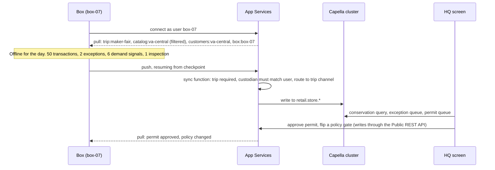

# Capella App Services: channels, the sync function and conflicts

Capella App Services is the sync tier between the box and the cloud. It speaks the Couchbase Lite replication
protocol, runs a small JavaScript function on every write to validate it and decide who may see it, keeps the
documents in the Capella cluster where SQL++ and the agents can reach them, and hands conflicts to the
application's resolver instead of guessing.



## How Store in a Box uses it

**Channels decide what reaches the venue.** A box's user holds four channels: `trip:<trip-id>` (its
allocations, allowances, transactions, exceptions, demand signals, policy, permits, pack plan),
`catalog:<region>` (the product subset), `customers:<region>` (the member subset) and `box:<box-id>` (its own
config and briefings). A tablet's user holds the same set through its box. The chain's other 40,000 SKUs and
other regions' members are not filtered out at the venue. They never arrive.

**The sync function does three jobs.** Validation (a `trip` is required on venue documents; the type must match
the collection), authorisation (the writing user must already hold the trip channel; a tablet cannot write a
transaction with another custodian's id), and routing (`channel("trip:" + doc.trip)`). It is short enough to
put on screen, which is the point.

```javascript
function (doc, oldDoc, meta) {
  if (doc._deleted) { return; }
  if (!doc.trip) { throw({ forbidden: "trip is required" }); }
  if (doc.type === "transaction" && doc.custodian !== meta.user.name) {
    throw({ forbidden: "a device writes only its own transactions" });
  }
  requireAccess("trip:" + doc.trip);
  channel("trip:" + doc.trip);
}
```

**Filtering fields, not just documents.** The venue's product documents carry no cost, supplier or margin. The
demo achieves this with a venue-facing projection of the catalog (a `product_venue` view written by Eventing or
the packing step) routed to `catalog:<region>`, while the full `product` stays in a channel the box does not
hold. The tablet's copilot saying it has no margin data is the visible result.

**Conflicts hand off to the resolver.** Most documents in this model are written by one custodian, so conflicts
are rare. The ones that happen are the ones that must become exceptions:

- Two sales against the same last unit (one at the flagship through the cloud, one on the road) do not pick a
  winner. The custom resolver writes an `exception` of type `oversell` with both transactions attached and a
  proposed resolution, and zeroes the allocation.
- Two charges against split slices of one `allowance` that together exceed it produce an `overspend` exception
  the same way.
- A unit scanned by two devices produces a `double_scan` exception, not a phantom unit.
- Everything else is last-write-wins, which for policy, permits and briefings is correct.

The resolver is application code and runs on the device, the box and in App Services. The demo says so.

**Delta sync.** A price change edits one field on 10,000 documents. The box pulls the deltas, not the documents,
and the byte counter on the box shows it. A day's transactions push in kilobytes.

**Revocation is purge.** Lose access to a channel and the documents leave the device on their own. The
lost-tablet drill: revoke the tablet's user in Capella, and on its next contact every trip, catalog and customer
document is removed. The box can also stop vending the encryption key to a tablet that does not return, so a
tablet that never reconnects is unreadable rather than merely un-updated.

**Two-way writes from HQ.** The HQ screen approves permits, flips policy gates and dispositions exceptions as
ordinary document writes through App Services, as an app user scoped by channels rather than an administrator.
Those writes flow down to the box and the tablets like anything else. See [permit-flow](permit-flow.md).

## Talking points

- "Nine lines of JavaScript are the whole access model, and they live with the data."
- "The other forty thousand SKUs are not hidden on the tablet. They were never sent."
- "A conflict here is not a bug to resolve. It is an exception to review, with both sides attached."
- "Ten thousand price changes came down as a few hundred kilobytes. The box moves what changed."
- "Revoke the tablet and it empties itself. No wipe, no remote management agent."

## Possible enhancements

- Roles instead of per-user channel lists, so adding a region or a trip is one change.
- OIDC sign-in for clerks, with channel grants mapped from group claims.
- Push filters that hold product images until the box is on Wi-Fi while transactions go over cellular.
- The `_changes` feed driving the HQ screen live instead of polling.
- XDCR between App Services clusters for a national chain's regions.

## Alternatives and trade-offs

| Option | Trade-off |
|---|---|
| **Self-hosted Sync Gateway** | Same protocol, same sync functions, full control of the deployment and the admin API. You run, patch and scale it. |
| **Custom REST plus a queue** | Total control, and you rebuild checkpoints, conflict handling, blob transfer, delta sync and per-device filtering. The custody model survives; the sync underneath it becomes your product. |
| **Filtering in the app** | Not security. The data is already on the device. Channels decide before the bytes leave the server. |
| **Server-side last-write-wins for everything** | Simple, and the last unit sold twice becomes one lost sale that nobody can see. The custom resolver is what turns that into an exception. |

Related: [edge-server-box](edge-server-box.md) · [capella-reconcile](capella-reconcile.md) ·
[couchbase-lite-custody](couchbase-lite-custody.md) · [permit-flow](permit-flow.md)
