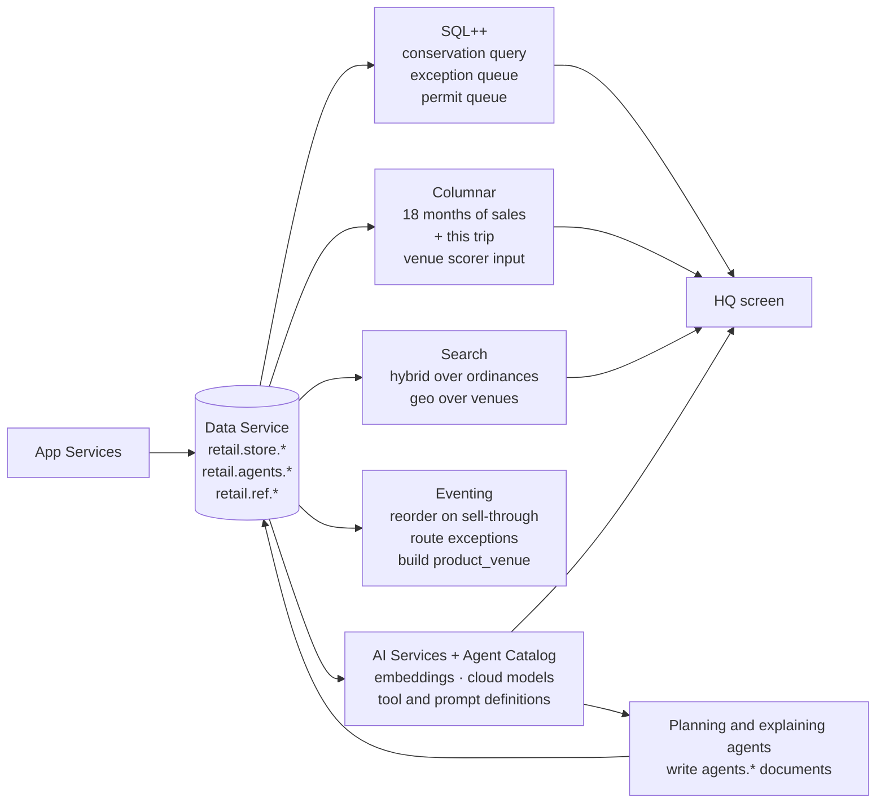

# Capella: system of record, reconciliation and the planning side

Once the box phones home, data a tablet wrote in a field with no signal is ordinary Capella data: SQL++,
indexes, joins, Search, Columnar, Eventing. The conservation query that proves the trip is one statement. The
agents that planned the trip and the agent that explains it run here. So does the HQ screen.

## How Store in a Box uses it

**The conservation query is the proof.** For every SKU, store on-hand plus every active allocation at every
level of the custody tree plus units sold plus units returned to stock equals opening on-hand plus received.
It runs live on the HQ screen before, during and after the trip. During the trip two of the custodians it sums
over are out of range and the answer does not change, because custody moves were recorded on the box before the
tablets left. Any gap is shrinkage by definition and Eventing turns it into an `exception`.

**Reconcile is a read, not a procedure.** Because every custodian reconciled with its peers at the venue (see
[device-to-device-sync](device-to-device-sync.md)), the cloud receives a consistent picture and has nothing to
merge. The exceptions it does receive (oversell, overspend, double-scan, a flagged permit) were created by the
ledger on whichever node saw the fork first, and HQ's reconciler finds any the venue did not, with both sides
attached. The HQ exception queue is a SQL++ query over `store.exception` with `status = 'open'`.

**The reconciliation explainer.** Rather than a conflict report, an agent reads the trip's allocations,
transactions and exceptions and writes a narrative onto the `trip` document: "50 packed, 44 sold, 3 returned, 2
transferred to the phone, 1 unaccounted for; last scanned at 15:40 on tablet B." People read narratives.

**Returns anywhere.** A customer returns at the flagship something bought at the pop-up. The flagship's lookup
hits the same `store.transaction` collection. The venue's return policy variant is on the `policy` document for
that trip, so the adjudication is a query and a rule, with an agent proposing approve, partial or deny.

**Eventing closes the operational loop.** Sell-through on a SKU during the trip fires a reorder. A new exception
routes to the right queue. The venue-facing `product_venue` projection (no cost, no margin) is rebuilt when the
catalog changes, so the filtering described in [app-services-sync](app-services-sync.md) is a derived document,
not an app-side mask.

**Columnar feeds the next trip.** Eighteen months of synthetic sales, three past pop-ups, loyalty density by
geography, online ship-to addresses and the trip that just ended are the venue scorer's input. The scorer's
output is five `venue_candidate` documents with reasons and evidence references, and the loop is closed:
the retrospective from this trip is evidence for the next one.

**Search runs the compliance agent's retrieval.** Hybrid search over `ref.ordinance` with jurisdiction as a
hard filter and semantic over the question. Geo search over venues and jurisdictions for the scorer. See
[agents-and-evaluation](agents-and-evaluation.md).

**Agent Catalog holds the tools.** Every agent's tool definitions and prompts are catalogued and versioned, so the
HQ screen can show which tools the compliance agent called and the eval harness can pin a prompt version to a
score. The on-box agents mirror their definitions by hand if the catalog does not reach the edge; the spec lists
that as a question to settle.

## Talking points

- "This query has the same answer before, during and after the trip. Two of the things it sums over are out of
  range right now."
- "There is no reconciliation job. The tablets reconciled with each other. The cloud reads the result."
- "The explainer wrote the end-of-day report. The exception queue is what it could not explain."
- "The trip you just watched is now a row in the next venue scorer's input."
- "Same bucket the agents plan from, same bucket the clerk sold into, same bucket the auditor reads."

## Possible enhancements

- **Couchbase AI Data Plane (possible, not in the demo).** At rejoin, a reconciliation assistant could draft a
  proposed resolution for each open exception with both branches as evidence, stored as advice and never as the
  resolution: HQ still decides (decisions 007 and 008). `ai_summary` in SQL++ could put a one-line summary beside
  each dispute on the queue, and, once closes exist, a checker could explain a manifest that does not match HQ's
  count. AI Functions need a paid cluster on Server 8.0 or later with multiple availability zones and Developer Pro
  or Enterprise support. See [ai-data-plane](ai-data-plane.md) (R2, R3, R5).
- Shrinkage patterns across trips as suggestions with evidence, never accusations.
- A fleet dispatcher across boxes and weekends, once there is more than one box.
- Kiosk home-delivery orders fulfilled from the warehouse when the box phones home.
- XDCR to a second region for a national chain.

## Alternatives and trade-offs

| Option | Trade-off |
|---|---|
| **Separate analytics warehouse** | Another copy, another ETL, another delay before the trip's sales are in the scorer. Columnar reads the operational data where it is. |
| **A reconciliation batch job** | Needed when the edge cannot reconcile itself. Here every custodian already did, so the job would have nothing to do and one more thing to break. |
| **A rules engine for exceptions** | Fine for routing, which Eventing already does. The explainer's value is the narrative, which a rules engine does not write. |
| **Agents in a separate orchestration service with its own store** | Nothing the agents know is where the clerk's data is, the audit trail is a second system, and the on-box agents cannot participate. |

Related: [app-services-sync](app-services-sync.md) · [agents-and-evaluation](agents-and-evaluation.md) ·
[edge-server-box](edge-server-box.md)
