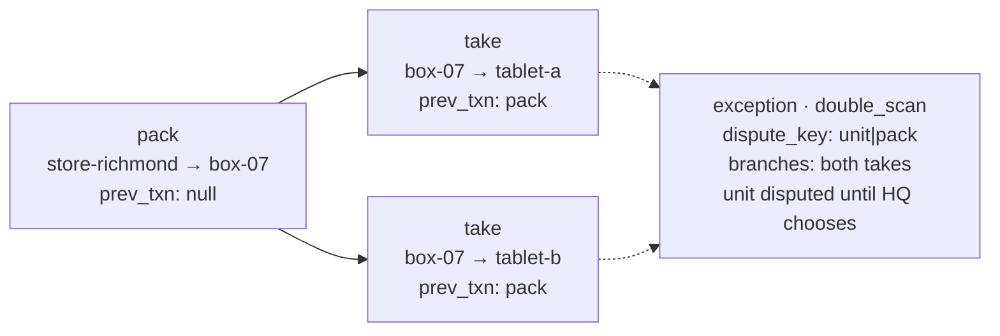

# The conflict-free ledger: custody that never conflicts

Store in a Box sells offline on tablets that split apart and meet again in any order, and it promises the same
answer whichever order the pieces meet in. It keeps that promise without a conflict resolver. Custody is a ledger
of immutable movements, each written once by one device and naming the movement before it. No node ever holds two
versions of one custody document to choose between, because nobody edits one. When two devices really did move the
same unit (two sales of the last rain shell, two tablets scanning the same jacket off the box), the ledger records a
**fork**: two movements with the same predecessor. Every node runs the same rules over the same movements and finds
the same fork, and the fork becomes an `exception` with both sides attached for a person at HQ to settle. The name on
stage is **conflict-free by construction**. The decision is [001](../decisions/001-ledger-not-resolver.md).

## The pattern in one paragraph

A unit's custody is a chain of immutable movements: the store packs it onto the box, a tablet takes it off the box,
the tablet checks it back in or sells it. A sale is one more movement, to the pseudo-custodian `customer`. Each
movement names its predecessor in `prev_txn`, so a unit's history is a chain from the pack to wherever it is now. A
count is not stored anywhere: the number of rain shells tablet B holds is the number of chains that currently end at
tablet B. A fork is two movements with the same predecessor (normally the same `prev_txn`): the record of two
devices each believing they moved the unit next. The reducer that turns movements into holders, counts and forks is
the same set of rules on every node, checked by the same golden fixtures, so every node that has the same movements
reaches the same answer. A fork is an `exception` with both branches attached and the unit `disputed` until HQ
chooses a branch. It is never a lost unit and never a phantom one.

## Why not a conflict resolver

**What the spec assumed.** Section 4.4 of the spec, as first written, had a custom conflict resolver running "on
the box and in App Services" for `allocation` and `transaction`: two decrements of one allocation that together
exceeded its quantity would make the resolver write an `oversell` exception and leave the allocation at zero.

**What was checked, on 2026-10-07.** Couchbase Edge Server 1.1 has no application hook for conflict resolution.
Capella App Services rejects a conflicting push from a client and leaves the resolution to Couchbase Lite on that
client. So for this topology (tablets, a box, App Services) there is no replication-layer place where one resolver
runs for everyone. Decision [001](../decisions/001-ledger-not-resolver.md) records the check and the choice.

**Why a resolver on some nodes is not enough.** Suppose the resolver ran only where Couchbase Lite runs. Two
tablets that edited one allocation document offline would conflict wherever the two revisions first met: on a
tablet, where the resolver runs, or on the box, where it does not. Whether the oversell became an exception, and
which version survived, would depend on where the conflict happened to be noticed, which is exactly what "the same
answer in any merge order" rules out. A resolver also starts too late: it sees two versions of a count, and by then
the facts it needs (who held the unit, which sale came after which) have been edited away.

**What Couchbase Lite's `ConflictResolver` is still for.** The rare same-document case decision 001 names: an
`allocation` closed twice. Allocations are edited only by their opener and only in `status` and `closed_at`, so the
case is narrow and either answer is safe. Custody and money never reach it.

## The documents

Three collections carry the ledger. Their schemas are `contracts/schemas/store/transaction.schema.json`,
`contracts/schemas/store/allocation.schema.json` and `contracts/schemas/store/exception.schema.json` (contracts
0.3.1), and `scripts/check_contracts.py` checks every fixture against them on every PR.

| Document | Id | What it holds |
|---|---|---|
| `transaction` | `txn::<hlc>` | One movement of one unit, written once and never updated. `kind` is `check_out`, `check_in` or `sale`. `unit_id` is the QR payload (`<SKU>#<serial>`); `from_custodian` and `to_custodian` say where it went; `prev_txn` names the movement that gave the writer's record its current holder (null for a pack, an HQ sale from the store, or a scan by a device with no record of the unit); `hlc` orders it; `device` is the writer. A sale also carries `price`, `tender` and `basket`, and goes to `customer`. |
| `allocation` | `alloc::<hlc>` | A slice of one SKU held by one custodian, with its `parent`. It has **no quantity**: how many units an allocation holds is derived by the reducer from the movements that name it in `to_allocation`. |
| `exception` | `exc::<detector>::<unit_id>::<hash8>` | One dispute about one unit, as one detector saw it: `kind` (`oversell`, `double_scan`, `unexpected_check_in`), `dispute_key`, `fork_txn` (the shared predecessor, null for a root fork), `transactions` (the branch ids, sorted) and `branches` (each one's device, kind, destination and `hlc`), a `proposed_resolution`, `status` (`open` or `resolved`) and HQ's `resolution` (`by`, `at`, `chosen_txn`, `note`). |

An `hlc` is a hybrid logical clock, `<unix ms>-<counter>-<device>`, whose string order is causal order. `hash8` is
the first eight hex characters of the SHA-256 of the exception's `transactions`, sorted and joined by `|`, so two
detectors that see the same fork write the same id suffix, and a new branch at the same fork gives a new id. The
`dispute_key` is `<unit_id>|<predecessor>` for a fork (`<unit_id>|root` for a root fork) and
`<unit_id>|<check-in id>` for an unexpected check-in: several detectors may each write their own copy of one
dispute, and HQ groups them by this key.

The sync function backs the immutability: an update to a transaction is rejected
(`contracts/fixtures/sync/transaction-update-forbidden.json`), and only `hq` may change an exception, and only its
`status` and `resolution` (`contracts/fixtures/sync/exception-update-by-box-forbidden.json`,
`contracts/fixtures/sync/exception-resolve-by-hq-ok.json`).

## The reducer

The reducer is three pure functions: `reduce(transactions, resolutions)` gives each unit's holder, allocation,
state and last movement, the counts and the forks; `exceptions_for(state, detector, trip, box)` gives the exception
documents that detector must write; and `conservation(state, store, inventory)` gives one row per SKU. The rules are
stated in `contracts/fixtures/README.md`, the contract every implementation is judged by. In words:

1. **A unit's movements form a forest by predecessor.** A movement's predecessor is the transaction its `prev_txn`
   names, whether or not this node has received it yet. One case is different: a *blind* movement, a take or a sale
   written with `prev_txn` null by a device that had no record of the unit (a tablet scanning a jacket off the box
   before the pack of it replicated). It still says where the unit came from, so the reducer links it under the
   movement that gave that custodian custody: the one whose `to_custodian` is the blind movement's
   `from_custodian`, with the greatest `hlc` below the blind movement's own (decision
   [005](../decisions/005-blind-movements-continue-the-chain.md)). A root is a movement whose predecessor is not in
   the input. A *store root* is a pack or an HQ sale straight from the store. A *dangling root* names a predecessor
   that has not arrived, and is not an error: replication may simply not have delivered it yet.
2. **A fork is two or more movements of one unit with the same predecessor**, whether or not this node has that
   predecessor: two takes that both name a pack this node has not received are already a fork, and the pack's
   arrival changes nothing. A *root fork* is two store roots of one unit: two packs, or a pack and an HQ sale. A
   blind movement whose predecessor has not arrived is in no fork yet, and a check-in with `prev_txn` null never
   joins one.
3. **An unresolved fork makes the unit `disputed`**: no holder, no allocation, counted under `disputed` and nowhere
   else. Only HQ resolves. A resolution counts only when `resolution.by` is `hq`, and the reducer enforces that
   itself, because tablet-to-tablet sync never runs the App Services sync function. A resolution chooses one branch;
   the other branches and everything after them are set aside, and the fork stays on record with the resolution's
   id.
4. **Otherwise the leaf holds.** The unit's holder is the `to_custodian` of the last movement in its chain. When a
   node has several chains for one unit (a dangling root beside a pack, say), the leaf with the greatest `hlc` wins.
   A unit whose leaf is a sale is `sold`; otherwise it is `held`.
5. **Reduction is a pure function of the set** of transactions and resolutions. Duplicates collapse; the order in
   which documents arrived never changes the result.
6. **An unexpected check-in stands.** A check-in by a device that did not hold the unit, or one with `prev_txn`
   null, still moves the unit (the physical scan is the stronger evidence) and raises its own
   `unexpected_check_in` exception.
7. **Detectors create, HQ resolves.** `exceptions_for` writes one exception per unresolved fork and one per
   unexpected check-in, and never edits one. A new branch at a fork already reported is a new document with a new
   id. A dispute HQ has already resolved, with the same `dispute_key` and the same transactions, is not written
   again.

Conservation is a check on top of the reduction (decision
[004](../decisions/004-conservation-holds-is-a-check.md)). Every unit the ledger knows is in exactly one of four
places (back at the store, with some other custodian, sold, disputed), so summing those is an identity, not a test.
What a row's `holds` tests is that the ledger agrees with what the store released: no unit appeared at the venue
that never left the store (`untraced` is 0) and, where HQ has the store's inventory, the store did not release more
than it had (`store_on_hand` is not negative).

## Worked example

Two golden fixtures, walked by hand from the files. Every value below is the fixture's `expected` block; the
reviewer checks them against the files. Both fixtures are trip `trip-2026-10-18-riverfest`, box `box-07`, store
`store-richmond`, and one blue medium rain shell, `JKT-RAIN-M-BLU#001`. The full ids are long, so the walk names
each transaction by a letter.

### The double-scan: `contracts/fixtures/ledger/double-scan.json`

Both tablets take the same jacket off the box while they are out of range of each other.

| | Id | Movement | `prev_txn` |
|---|---|---|---|
| P | `txn::1792328410000-0000-tablet-a` | `check_out` store-richmond → box-07, by tablet-a at 13:00:10 (the pack) | null |
| A | `txn::1792328510000-0000-tablet-a` | `check_out` box-07 → tablet-a, at 13:01:50 | P |
| B | `txn::1792328511000-0000-tablet-b` | `check_out` box-07 → tablet-b, at 13:01:51 | P |

**The chain.** P is a store root (no predecessor, from the store). A and B both name P. **The fork:** two
movements with the same predecessor, P. No resolution is in the input, so the fork is open and the unit is
`disputed`: holder, allocation and last movement are all null.

**Counts.** None: a disputed unit is counted under no custodian. All three allocations the movements name (the
box's, `alloc::1792328400000-0000-tablet-a`, and each tablet's, `alloc::1792328500000-0000-tablet-a` and
`alloc::1792328501000-0000-tablet-b`) count 0.

**The exception** (detector tablet-a):

- `kind` is `double_scan`: the branch with the greatest `hlc` is B, and B is a `check_out`, not a sale.
- `fork_txn` is P, and `dispute_key` is `JKT-RAIN-M-BLU#001|txn::1792328410000-0000-tablet-a`.
- `transactions` are A and B, sorted. The id suffix is the SHA-256 of
  `txn::1792328510000-0000-tablet-a|txn::1792328511000-0000-tablet-b`, first eight hex characters `111c7a4e`, so
  the id is `exc::tablet-a::JKT-RAIN-M-BLU#001::111c7a4e`.
- `proposed_resolution` is `review`, "Scanned out twice. Choose the movement that matches where the unit is.";
  `status` is `open`, `box` is `box-07`.

**Conservation** (venue only; the fixture has no inventory). One row for `JKT-RAIN-M-BLU`: `left_store` 1,
`untraced` 0, `returned_to_store` 0, nothing in custody, `sold` 0, `disputed` 1, `holds` true. The one unit left
the store once (its root is a pack), and it is in exactly one place: disputed. The double-scan did not make two
jackets, and it did not lose one.

### The staged oversell: `contracts/fixtures/ledger/oversell-hq.json`

The jacket is packed onto the box and sold at the venue; meanwhile the flagship, which still believes it has the
jacket, sells it too.

| | Id | Movement | `prev_txn` |
|---|---|---|---|
| P | `txn::1792328410000-0000-tablet-a` | `check_out` store-richmond → box-07, by tablet-a at 13:00:10 (the pack) | null |
| S | `txn::1792329000000-0000-tablet-a` | `sale` box-07 → customer, by tablet-a at 13:10:00, $129.00 cash | P |
| H | `txn::1792329100000-0000-hq` | `sale` store-richmond → customer, by hq at 13:11:40, $129.00 simulated card | null |

**The chain.** P and H are both store roots: neither names a predecessor and both start at the store. S continues
P. **The fork** is a root fork, two store roots of one unit, with branches P and H. The fork is at the root, not at
P, so tablet-a's sale S is not a branch; it is the leaf of branch P. Choosing branch P keeps tablet-a's sale;
choosing H keeps HQ's. The unit is `disputed`.

**Counts.** None. The box's allocation `alloc::1792328400000-0000-tablet-a` counts 0.

**The exception** (detector tablet-a):

- `kind` is `oversell`: the branch with the greatest `hlc` is H, and H is a sale.
- `fork_txn` is null (a root fork), and `dispute_key` is `JKT-RAIN-M-BLU#001|root`.
- `transactions` are P and H, sorted. The SHA-256 of
  `txn::1792328410000-0000-tablet-a|txn::1792329100000-0000-hq` begins `57cf515b`, so the id is
  `exc::tablet-a::JKT-RAIN-M-BLU#001::57cf515b`.
- `proposed_resolution` is `refund`, "Sold twice. Refund one sale, then choose the branch that stands."; `status`
  is `open`, `box` is `box-07`.

**Conservation, and why it still holds with `disputed: 1`.** With the store's inventory (opening on hand 12,
received 0): `left_store` 1, `untraced` 0, `returned_to_store` 0, nothing in custody, `sold` 0, `disputed` 1,
`store_on_hand` 12 + 0 − 1 + 0 = 11, `holds` true. The venue-only row is the same with the inventory fields null,
and also holds. Two sales of one jacket are not two jackets sold: the ledger counts the unit once, as disputed,
and the store let it go once. A count-based system would have recorded two sales of one jacket, or quietly dropped
one; the ledger records one unit, one dispute, and both sales waiting on a person.

### Any order: `contracts/fixtures/ledger/merge-order-independent.json`

Ten jackets, `#001` to `#010`, are packed onto the box. Tablet B takes eight (the split), sells three
(`#001`, `#002`, `#003`) and checks the other five back in to the box (the merge). That is 26 movements, and the
fixture lists them scrambled: a check-in before the take it follows, sales before the pack. The expected result is
the same as the unscrambled story: three units `sold`, seven `held` by box-07 (the five returned and `#009`,
`#010`, which never left), one count row `box-07` 7, the box's allocation 7 and tablet B's allocation 0, no
forks, no exceptions, and a conservation row with `left_store` 10, box-07 holding 7, `sold` 3, `holds` true. The
fixture is marked `order_independent`, so every implementation's test runner also reduces it with the array
shuffled and must get the same answer every time. That is what "merge in any order" means here: the result is a
function of which movements a node has, never of the order they arrived in.

## The same reducer on every node

The reducer runs wherever custody is read, and nowhere else:

- **The tablets** (Swift, Couchbase Lite; WS4 builds the reducer and WS6 the screens): the Shelf, the custody tree
  on the device, and the exceptions a tablet writes as detector when it sees a fork.
- **HQ** (Python; WS1 is the reference reducer, WS5 the HQ screen and its reconciler): the conservation panel, the
  exception queue grouped by `dispute_key`, and HQ's own exceptions as detector `hq`.
- **The box** (Couchbase Edge Server): none. The box stores and forwards documents; it runs no custody logic and
  needs none.

Two implementations in two languages are kept in step by the golden fixtures in `contracts/fixtures/ledger/`, not by
either language's types: the fixtures are the source of truth, and their expected results are written by hand from
the rules, never generated by an implementation. A reducer that disagrees with a fixture is wrong, whichever
language it is in.

### Where it lives

| Artifact | Path | Checked by |
|---|---|---|
| The decision | `docs/decisions/001-ledger-not-resolver.md` | The owner (accepted 2026-10-07) |
| Blind movements | `docs/decisions/005-blind-movements-continue-the-chain.md` | The fixtures named in it |
| Conservation as a check | `docs/decisions/004-conservation-holds-is-a-check.md` | The fixtures `overpacked` and `untraced-unit` |
| The rules and the expected-output format | `contracts/fixtures/README.md` | The foreman (contract changes only) |
| Document schemas | `contracts/schemas/store/` | `scripts/check_contracts.py`, in CI on every PR |
| Golden scenarios | `contracts/fixtures/ledger/` | `scripts/check_contracts.py` validates their documents; every reducer must reproduce their `expected` |
| Fixture format | `contracts/schemas/fixtures/ledger.schema.json` | `scripts/check_contracts.py` |
| Immutability and HQ-only resolution in sync | `contracts/fixtures/sync/` (cases), `sync/functions/` (WS2) | `node --test sync/tests/`, in CI |
| Python reference reducer | WS1 (path added when it merges) | The ledger fixtures |
| Swift reducer on the tablets | WS4 (path added when it merges) | The ledger fixtures |
| HQ reconciler | WS5 (path added when it merges) | The ledger fixtures |

## What it costs

- **Counts are queries.** Nothing stores "tablet B has 5". The Shelf screen needs a derived local view of the
  ledger (the reducer's output, or a query that computes it), refreshed as movements arrive.
- **One dispute, several documents.** Every detector writes its own copy of a fork's exception, so the same
  double-scan can arrive from tablet A, tablet B and HQ. HQ groups them by `dispute_key` and resolves the group.
- **Two reducers.** Python and Swift implementations of the same rules have to stay in step. The golden fixtures
  are how: a rule change is a contract change, with new fixtures that both must pass.
- **A disputed unit is off the shelf.** Until HQ chooses a branch, the unit is counted under nobody, so no tablet
  can sell it again. That is deliberate (the alternative is guessing), and HQ has to act on the queue.
- **HLCs, not wall clocks.** When several chains end in different places, the leaf with the greatest `hlc` holds,
  so writers stamp hybrid logical clocks. Decision 005 names two clock-skew cases that are accepted until Phase 1's
  clock-skew work: in one the unit shows where it was until its writer moves it again, in the other it is disputed
  until HQ resolves. In neither is it lost or doubled.

## On stage: Conflict-free by construction

*Sixty to ninety seconds. The words below are copied into the Phase 0 runbook as they stand; change them here
first.*

**Before the beat.** The uplink is cut. One rain shell, packed onto the box before the cable came out, has been
sold on a tablet during the offline beats. On the HQ screen, the staged HQ sale of that same unit is ready in WS5's
stage control: the flagship's count-based till still believes it has the jacket. The HQ exception panel is not on
the projector yet.

**Do.**

1. Fire the staged HQ sale. Say: "Meanwhile, back at the flagship, someone just sold the same jacket."
2. Plug the cable in. Let the byte counter tick.
3. Open the exception on the HQ screen and show both branches: one is the pack onto box-07, whose chain ends in the
   tablet's sale; the other is HQ's sale.

**What the audience sees.** One `oversell` exception with two `branches`, side by side, and a proposed refund. On
the tablet, the jacket is `disputed`: counted neither on the Shelf nor as sold, and the same dispute is in the
tablet's exceptions. On the HQ screen, the conservation row for the rain shell still reads `holds`, with one unit
disputed.

**Say this.** "Two sales of the last unit are not a conflict. They are a fork in one unit's history, and the fork
is the exception, with both sales attached."

**If asked "where did the resolver run?"** "Nowhere. There isn't one. Every sale is a fact that is never edited,
so nothing ever conflicts. The tablet, and HQ, each run the same rules over the same facts and find the same fork;
each writes the same dispute under the same key. The box just carried the documents."

**If asked "what if the tablet is still out of range?"** "Then HQ finds it on its own. HQ already had the pack, and
its own sale forks with it, so the dispute is on this screen before the tablet comes back. The tablet keeps selling
everything else, and when it meets the box it finds the same fork and files the same dispute. Whichever side sees
it first, nobody waits for the other."

HQ's reconciler may list the dispute before the cable goes in, because the pack reached Capella before the cable
came out. Keep the exception panel off the projector until step 3, or use it: "HQ found it from its side; the
venue is about to find the same fork from its side."

## Talking points

- "Nothing here ever conflicts. Every movement is written once and never edited, so there is never a second version
  to choose between."
- "A count is a question, not a number we store. Ask it on any node and you get the same answer."
- "The fork is the exception. Both sides are attached, and a person decides."
- "There is no resolver to configure on the box, in App Services or on the tablet. There are rules, and a set of
  golden fixtures that every implementation has to pass."
- "Two sales of one jacket are one disputed jacket. The conservation row still holds."

## Possible enhancements

- Allowances on the ledger (Phase 1): an overspend as a fork in one allowance's chain, the same rules one
  collection over.
- The HQ screen showing each branch's whole chain (pack, take, sale) rather than its first movement.
- A resolution that writes the refund transaction itself, so "refund one sale" is one tap.
- Signed movements, so the chain is tamper-evident as well as conflict-free.
- A per-SKU exception when a conservation row does not hold, once Eventing maintains on-hand (Phase 2).

## Alternatives and trade-offs

| Approach | What you give up |
|---|---|
| **Last-write-wins counts** | Simple until two devices sell the last unit offline: one decrement overwrites the other, and the result is a silent oversell or a silent loss, with nothing left to show which. |
| **CRDT counters** | Correct totals in any merge order, but a counter knows how many, not which unit or who holds it. Two sales of the last unit become a count of −1, not a dispute with both sales attached. |
| **A replication-layer conflict resolver** | Not offered by Edge Server 1.1, and App Services leaves resolution to the client, so it would run on some nodes and not others, and the answer would depend on where the conflict was noticed. It also sees two versions of a document after the facts that decide between them are gone. |
| **A central lock or reservation service** | Correct and simple while everyone can reach it. A tablet that walks out of range cannot sell, and the split store is gone. |

## Related

[decision 001](../decisions/001-ledger-not-resolver.md) · [decision 004](../decisions/004-conservation-holds-is-a-check.md) ·
[decision 005](../decisions/005-blind-movements-continue-the-chain.md) · [overview](overview.md) ·
[couchbase-lite-custody](couchbase-lite-custody.md) · [device-to-device-sync](device-to-device-sync.md) ·
[app-services-sync](app-services-sync.md) · [edge-server-box](edge-server-box.md) ·
[capella-reconcile](capella-reconcile.md)
