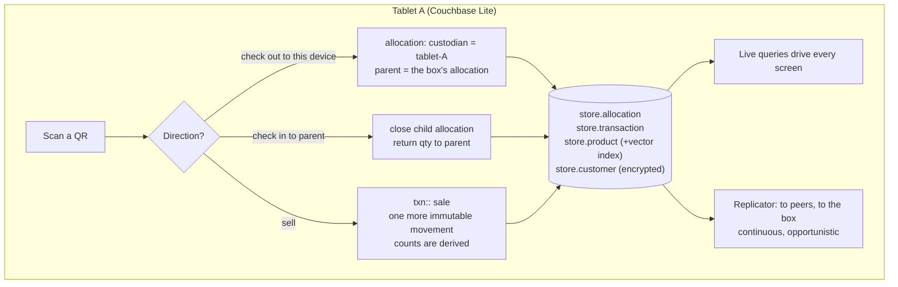

# Couchbase Lite and the custody model

Couchbase Lite is the database on every tablet and phone in the venue. It is the whole POS data layer:
collections, SQL++, live queries, a vector index, blobs and encryption, on the device. A sale is a local write.
So is a scan, a split and a merge. Nothing the clerk does waits for a network.

## How Store in a Box uses it

**Custody, not counts.** Inventory is modelled as units in custody. An `allocation` says who holds a slice of a
SKU and which allocation it was split from. The store allocates to the box, the box to a tablet, the tablet to
a phone. A sale is one more immutable movement, to the customer; nothing is decremented, because counts are derived
from the movements. Every unit is in exactly one place, so the proof of a correct day is one check, not an argument.

Conservation is per SKU and derived from the ledger, not summed from allocation quantities (allocations have none):
see [the reducer and conservation](conflict-free-ledger.md#the-reducer) in the conflict-free ledger note.

**Scan to check out, scan to check in.** Every unit, or every case, carries a QR. A device holding a Couchbase
Lite database is a custodian and has two gestures. Scanning while the device is the destination moves custody to
it (this is how Pack happens and how a split happens). Scanning while the device is the source moves custody back
to the parent (this is how Rejoin and a merge happen). A sale is a check-out to a customer with a tender attached.
The pick list, the split, the merge and the sale are one gesture and one document shape.

A scan that contradicts the record (checking in a unit the record says is elsewhere) does not fail. It writes
an `exception`, because the physical scan is the stronger evidence and the record is what needs explaining.

**Every sale is one batch.** The transaction, the allocation decrement and the allowance decrement (if the
customer pays on account) are written in a single `inBatch`. They land together or not at all, on a tablet at
3% battery.

**Live queries drive the UI.** The shelf count on tablet B is a live query over `store.allocation`. When tablet
A sells a unit and device-to-device replication delivers the change, the count moves with no refresh and no
server. The screens have no state of their own.

**Filtered replication keeps margin off the venue.** The product document in Capella has cost, supplier and
margin. The one on the tablet does not. Same document id, same collection name, fewer fields, because the
channel's sync function strips them on the way down. The clerk copilot proving it cannot answer "what's our
margin" is a feature.

**Encrypted at rest.** The database on each tablet is opened with an encryption key the box vends at pairing.
Customer documents on a tablet that does not return are unreadable. See [offline-loyalty](offline-loyalty.md).

**Vector index on the device.** `store.product` carries a precomputed embedding. A vector index over it answers
"anything waterproof in a medium" and powers the upsell advisor, with the radio off.
See [hybrid-upsell](hybrid-upsell.md).

**Blobs.** Product thumbnails, the approved permit PDF, the inspector's signature photo and the clerk's voice
note are blobs. They sync like any other field and are on the tablet when the fire marshal arrives.

**Document history.** Revisions are kept long enough to answer "what did inventory look like at 2pm" on the
tablet, offline, which is the end-of-day argument with the store manager settled on the spot.

## Talking points

- "A unit is wherever it was last scanned. That sentence is the whole inventory system."
- "Pack, split, merge and sell are the same gesture. There is no transfer screen."
- "The sale, the stock decrement and the credit decrement are one batch. Not three writes with a retry loop."
- "Same collection names on the phone, the box and the cluster. Nothing is translated."
- "The tablet does not have a margin column. Not hidden. Not there."

## Possible enhancements

- Case-level and unit-level QR in the same model: a case allocation that splits into unit allocations on first
  scan of a unit.
- Time-boxed custody: an allocation that auto-flags if its custodian has not been seen by any peer in N hours.
- Signed scans: each scan carries a device signature so the custody chain is tamper-evident, the way FieldProof
  hashes evidence at capture.
- A tablet-local "what did I do today" report from document history, for the clerk to hand in.

## Alternatives and trade-offs

| Option | Trade-off |
|---|---|
| **Counts with last-write-wins** | Simple until two devices sell the last unit offline. Then it is a silent loss or a silent oversell, and nobody knows which. |
| **Counts with CRDT counters** | Correct totals, but a counter cannot tell you which custodian has the units, so a split store has no idea what it is holding. |
| **Central inventory service with an offline queue** | Every scan is a deferred request, every merge is the server's problem, and a tablet that walks away is blind. The custody tree makes every node self-sufficient. |
| **SQLite plus hand-written sync** | You own conflicts, checkpoints, blobs and encryption key handling. The database part is fine; the sync part is the product you did not mean to build. |

Related: [device-to-device-sync](device-to-device-sync.md) · [app-services-sync](app-services-sync.md) ·
[hybrid-upsell](hybrid-upsell.md) · [offline-loyalty](offline-loyalty.md)
