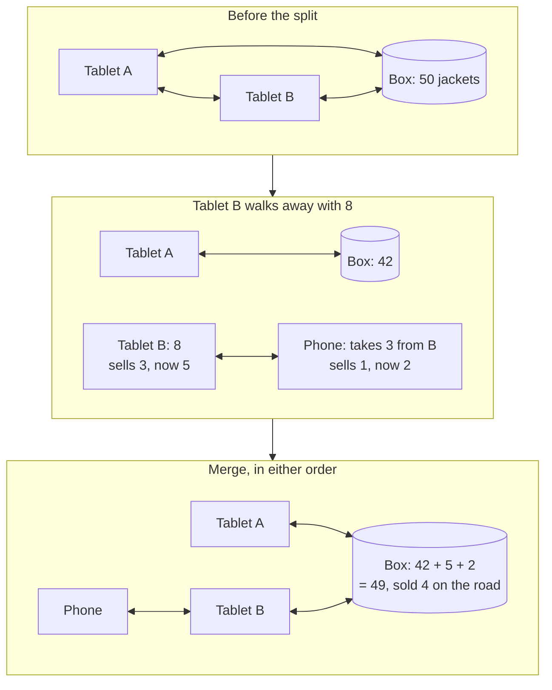

# Device-to-device sync: splitting the store and merging it back

Couchbase Lite replicates directly between devices with no server in the path. In Store in a Box that is what
turns "offline mode" into "every node is a store": three tablets at one booth are three replicas of the same
store, a tablet that walks off with eight jackets is a smaller store, and two custodians that meet reconcile
with each other and are done. The cloud finds out later.

## How Store in a Box uses it

**Multiple units at one sale.** Tablets A and B at the same booth each run a continuous replicator to the box
and a peer replicator to each other. A sale on A appears in B's live queries in about a second. If the box is
powered off, A and B keep each other current directly. There is no primary tablet, so there is nothing to fail
over.

**The split is a scan, not a mode.** Tablet B's clerk scans eight jackets off the box with B as the destination.
That writes child allocations with `parent` pointing at the box's allocation and `custodian: tablet-B`, and the
box's allocation drops by eight. Tablet B walks out of range. Its replicators go idle and its queries, sales and
upsell suggestions carry on against its own database. Nothing on B knows or cares that it is alone.

**Splitting again.** A roaming seller's phone scans three jackets off tablet B, at the far end of the festival,
with neither device able to see the box. The phone's allocation has `parent` pointing at tablet B's. The tree is
now store, box, tablet B, phone. Every level is selling.

**Merging is a scan, in any order.** When the phone comes back to tablet B, it scans its remaining units in, which
closes the phone's allocation and returns the quantity to B's. When B reaches the box, the same thing happens one
level up. It is equally fine for B to merge into the box first and the phone to catch B later: the closed child
allocation and the phone's two sales replicate to B, then to the box, and the totals land in the same place.
Merge order does not matter because custody moves are additive facts, not edits to a shared number.

**Reconciliation without the cloud.** When B meets the box, replication exchanges every document each side has
not seen. Allocations, transactions, exceptions, demand signals. That exchange *is* the reconciliation, and it
is final. Capella receives the result when the box next has a link and has nothing to adjudicate. The demo's
line: "nobody asked the cloud."

**Conflicts are rare by design, and handled when they happen.** Because each custodian decrements only its own
allocation, two devices do not usually write the same document. The cases that do (a double-scan of one unit,
or a split allowance overspent across two slices) are exactly the cases that should be exceptions, and the
custom conflict resolver turns them into one with both versions attached. See
[app-services-sync](app-services-sync.md); the same resolver runs on the device.

**Discovery.** On the venue network the phone finds tablet B through the peer listener. Where there is no
shared network the demo uses a hotspot per node, which is also how a real roaming seller would be set up.
Which one the demo uses is an open question in the spec; either way the custody model does not change.

## Talking points

- "Tablet B is not offline from the store. Tablet B is a store."
- "The split is a scan. The merge is a scan. There is no sync button because there is nothing to press."
- "Merge in either order, same answer, because custody is a fact that was recorded, not a number that was
  edited."
- "Reconciliation happened right there between two tablets. The cloud will hear about it."
- "Three tablets at one booth, no primary. Power off the box and they keep each other honest."

## Possible enhancements

- Box-to-box custody transfer: two boxes in a parking lot swapping stock, which is the same gesture one level up.
- A "who have I seen" panel on each device: last contact with each peer, from the replicator's own state, so a
  clerk knows which custodian is overdue.
- Opportunistic relay: a tablet that meets both the box and a stranded phone carries documents between them
  without being a custodian of the units involved.
- Mesh of boxes at a large venue, each a peer, reconciling with each other before any of them see the cloud.

## Alternatives and trade-offs

| Option | Trade-off |
|---|---|
| **Hub-only sync (every device talks only to the box)** | Simple topology. Power off the box and every tablet is alone; walk out of range and you cannot sell. The split beat disappears. |
| **Bluetooth hand-rolled exchange** | You design the protocol, the checkpoints, the conflict rules and the blob transfer. Couchbase Lite already speaks its own replication protocol peer to peer. |
| **Cloud as the only meeting point** | Reconciliation waits for signal. Two tablets a metre apart cannot agree on a count until a server in another state tells them. |
| **One tablet designated primary** | A split now needs an election, and the primary walking away strands the rest. Every-node-is-a-store has no such role. |

Related: [couchbase-lite-custody](couchbase-lite-custody.md) · [edge-server-box](edge-server-box.md) ·
[app-services-sync](app-services-sync.md)
