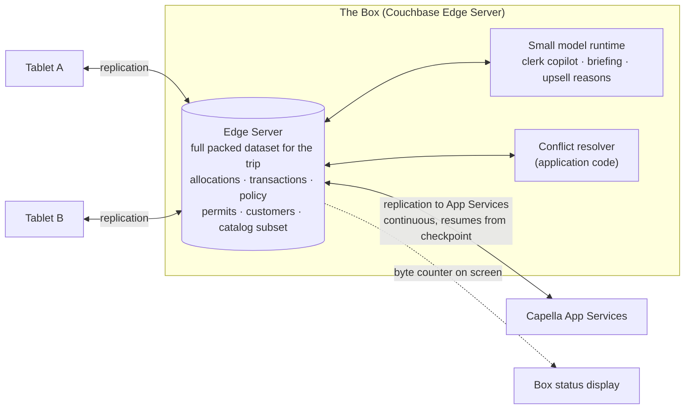

# Couchbase Edge Server: the box

The box is the thing you carry. A Raspberry Pi or a laptop running Couchbase Edge Server, holding the whole
packed dataset for the trip, serving the tablets in the venue, running the small model for the on-box agents,
and carrying the venue's changes up to Capella whenever it has a link. It is a store-sized server that fits in a
backpack.

## How Store in a Box uses it

**The venue's hub, not its single point of failure.** Tablets replicate to the box and to each other. The box is
where the whole trip's data lives in one place, which is what makes it the right home for the on-box agents and
the evening briefing. If it is powered off the tablets keep selling through
[device-to-device sync](device-to-device-sync.md); when it comes back they catch it up.

**Lightweight on purpose.** Edge Server is built for constrained hardware. The demo's box is a Raspberry Pi 5
with 8 GB, and the open question in the spec is whether the small model fits on it at demo-acceptable latency or
whether v1 uses a laptop. Either is a box.

**The box phones home lazily.** Its replicator to App Services is continuous and opportunistic. It runs when a
link exists, resumes from a checkpoint when the link reappears, and never blocks a write on the venue side. The
demo throttles the uplink to 2G speeds and shows sync progressing in the background; cuts it mid-sync and shows
the checkpoint document; restores it and shows the resume. A byte counter on the box's status display makes
delta sync visible: a day of fifty transactions reconciles in tens of kilobytes, and a 10,000-SKU price change
from HQ arrives as a few hundred.

**Runs the on-box agents.** The clerk copilot, the evening and morning briefings and the upsell advisor's reason
line all run against a small model on the box, with local queries as their tools. They degrade gracefully: with
the box down the copilot is gone and the upsell suggestions still appear without their reason line, because the
hybrid query runs on the tablet itself. With the uplink down but the box up, everything works. With the uplink up,
the same questions can route to Capella AI Services for a larger model. One API, three tiers.

**Holds the venue's policy and permits.** The `policy` document for the trip (allowance caps, permitted tender
kinds, permit gates, upsell weights) and every `permit` document are on the box and on each tablet. HQ can flip a
gate and it takes effect at the venue after the next sync; the field can record an inspection and HQ sees it on
the next contact. See [permit-flow](permit-flow.md).

**Vends the encryption key.** Tablets pair with the box and receive the database encryption key; a tablet that
does not come back can be denied the key on its next attempt. Together with channel revocation this is the
lost-tablet drill. See [offline-loyalty](offline-loyalty.md).

**Runs the same conflict resolver as the cloud.** When the box receives two conflicting revisions (from two
tablets, or from a tablet and the cloud), the application's resolver turns the ones that matter into exception
documents. See [app-services-sync](app-services-sync.md). Confirm against current Edge Server docs where the
resolver can run; the spec lists it as an open question.

## Talking points

- "This is the store. It fits in a backpack, and the tablets do not need it to be on."
- "Throttle the link to 2G. Nothing in the venue got slower. Only the cloud's view did."
- "Fifty sales, forty kilobytes. Ten thousand price changes, a few hundred. The box moves changes, not
  documents."
- "Pull the plug mid-sync. Put it back. It picks up where it left off, from a checkpoint it keeps itself."
- "The small model lives here. Kill the box and the clerk loses the chat. The register does not notice."

## Possible enhancements

- Two boxes at a large venue as peers, reconciling with each other before the cloud.
- The box as a Wi-Fi access point so the venue needs no network at all.
- Scheduled "quiet hours" replication so a cellular uplink is only used after close.
- Edge Server hosting the HQ-style status screen locally, so a venue manager sees the conservation query without
  a cloud round trip.

## Alternatives and trade-offs

| Option | Trade-off |
|---|---|
| **No box, tablets straight to the cloud** | Every tablet needs its own uplink, there is no venue-wide dataset for the on-box agents, and a flaky venue connection is every tablet's problem instead of one device's. |
| **A full Couchbase Server node at the venue** | Works, and is the right answer for a permanent remote store. Heavier than a backpack wants, and more to operate for a weekend. |
| **A laptop running the POS as a server with a local database** | The tablets become thin clients of the laptop. Close the laptop and the venue stops. Edge Server plus Couchbase Lite on every tablet means no node is load-bearing. |
| **Cloud-only with an offline cache on each tablet** | The cache cannot be a peer, cannot split and cannot reconcile with another tablet. It is a buffer, not a store. |

Related: [device-to-device-sync](device-to-device-sync.md) · [app-services-sync](app-services-sync.md) ·
[capella-reconcile](capella-reconcile.md)
