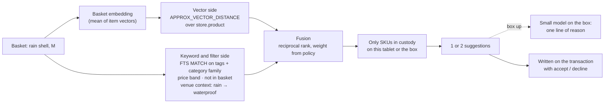

# Hybrid search on the tablet: the upsell advisor

When the clerk scans the second item into a basket, the tablet proposes one or two add-ons. The proposal is a
hybrid query inside Couchbase Lite: vector similarity to the basket, fused with keyword and structured filters,
over the catalog that was packed. It runs on the device with no network in under a second, and it only ever
suggests something the customer can walk away with.



## How Store in a Box uses it

**Two retrieval signals, one statement.** The vector side answers "goes with this": the basket's embedding
against the product vector index. The keyword and filter side answers "makes sense here": a full-text match on
product tags plus structured predicates for category family, price band, exclusion of what is already in the
basket, and the venue context from the `policy` document (rain forecast boosts `waterproof`, cold boosts
`insulated`). Both run in SQL++ against the same collection on the tablet.

```sql
-- Sketch of the upsell query. Both halves run on the tablet, over store.product.
-- Vector half: nearest products to the basket embedding.
SELECT META(p).id, p.name, p.price,
       APPROX_VECTOR_DISTANCE(p.embedding, $basketVec) AS dist
FROM store.product p
WHERE p.category_family IN $complements
  AND p.price BETWEEN $lo AND $hi
  AND META(p).id NOT IN $inBasket
ORDER BY dist LIMIT 20;

-- Keyword half: tags boosted by venue context, same filters.
SELECT META(p).id, p.name, p.price
FROM store.product p
WHERE MATCH(p.tags, $contextTerms)       -- e.g. "waterproof pack-cover socks"
  AND p.category_family IN $complements
  AND p.price BETWEEN $lo AND $hi
  AND META(p).id NOT IN $inBasket
ORDER BY RANK(p.tags) DESC LIMIT 20;
```

Fusion is reciprocal rank fusion across the two lists, in a dozen lines of app code, with the vector-to-keyword
weight read from `policy.upsell_weight` so the demo can change it from HQ and show the suggestions shift after
the next sync. Then one more filter: join to `store.allocation` for this custodian and its parent, so only units
physically present are offered.

**Degrades gracefully.** The query runs on the tablet. With the box up, the two suggestions go to the small model
on the box for a one-line reason ("rain tomorrow; you have a shell, not a hat"). With the box down the
suggestions appear without the reason. With the uplink up, the same request could go to Capella AI Services for
a richer reason. The ranking never depends on anything but the tablet.

**Member-aware when the member is there.** If the customer scanned a loyalty QR (see
[offline-loyalty](offline-loyalty.md)), prior purchases exclude repeats and tier can unlock a bundle price. The
member record is the minimal synced one; nothing is fetched.

**Every suggestion is recorded.** The suggestions, their scores and the clerk's accept or decline are written on
the transaction as `upsell_suggestion[]`. That is the advisor's evaluation signal, and it is also what the
research agent reads later to learn what pairs well at this kind of venue.

**The query goes on screen.** The way FieldProof puts its duplicate-check query up for twenty seconds, this demo
puts the upsell query up. A vector distance, a full-text match, a price band and a custody join in one
statement, on a tablet with the radio off, is the point.

## Talking points

- "Goes with this, and makes sense here. Two kinds of search, one query, on the tablet."
- "It will never suggest something that is not in the box. The custody join sees to that."
- "Pull the box's power. The suggestions still come. The reason line is what you lost."
- "Change the vector-to-keyword weight from HQ. Next sync, the socks move up."
- "Accept or decline is written on the sale. That is how the advisor learns, and how the research agent learns
  what sells together at a market."

## Possible enhancements

- Basket-level embeddings learned from past baskets rather than the mean of item vectors.
- Visual search: photograph an item the customer is wearing, find what in custody goes with it.
- Price-sensitivity by tier: a bundle offer that the pricing agent proposed and HQ approved.
- Re-ranking by a small model on the tablet itself where the hardware allows.
- **Couchbase AI Data Plane (possible, not in the demo).** A Data Processing workflow could embed the catalog in the
  cluster, so the vectors sync down and the tablet searches them offline; workflows are started, not run on write,
  so a catalog change means a re-run before the trip syncs. With the uplink up, the reason line could go to a Model
  Service deployment with semantic caching and guardrails. The ranking would still depend on nothing but the
  tablet. See [ai-data-plane](ai-data-plane.md) (R4, R6, R7).
- **The advisor as a catalogued agent (our design on Agent Catalog, possible).** Its prompt and its two tools (a
  semantic search over the products in custody, a SQL++ query for what this tablet holds) published in Agent
  Catalog, synced down by channel with the trip and run on the tablet with an on-device model; a missing catalog
  falls back to the built-in advisor. Starts with a spike. See [ai-data-plane](ai-data-plane.md) (R9).

## Alternatives and trade-offs

| Option | Trade-off |
|---|---|
| **Cloud recommendation service** | Nothing at checkout with the cable out, and it will happily suggest what is in the warehouse. |
| **Vector-only** | "Goes with this" without "makes sense here": it recommends a second shell, and ignores the rain. |
| **Keyword and rules only** | Brittle tag maintenance, no notion of similarity beyond what someone typed, and a new SKU is invisible until it is tagged. |
| **Precomputed bundles per SKU** | Fast and dumb: static, blind to the venue, the weather, the member and what is actually in custody. |

Related: [couchbase-lite-custody](couchbase-lite-custody.md) · [offline-loyalty](offline-loyalty.md) ·
[edge-server-box](edge-server-box.md)
