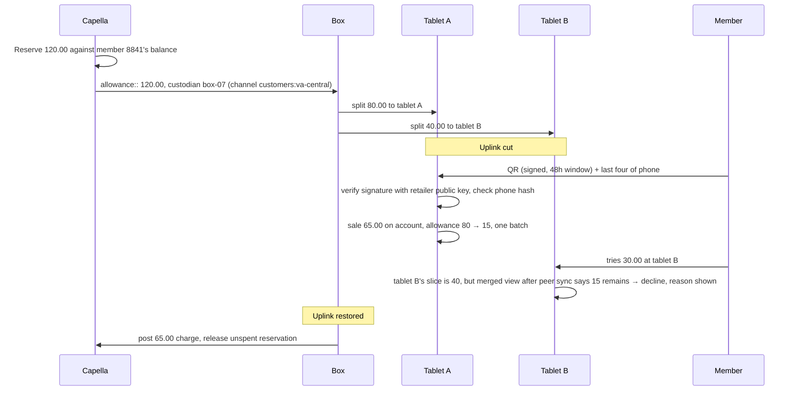

# Offline loyalty: credit as custody

A loyalty member can buy on their account with no connectivity: store credit, points, or "charge it and settle
later." The posture is pessimistic by default and still a real purchase. The retailer decides how much of its own
credit to carry to the venue; the box enforces that number without asking anyone; identity is verified on the
tablet with a signed QR and no lookup; and the data that makes it possible is minimal and encrypted.

## How Store in a Box uses it

**Allowance is an allocation.** Before the trip, Capella computes a per-member offline allowance for members in
the venue's region: the lesser of their store credit, points value and an account-charge limit set by policy
(say trailing average basket times two, capped per tier). It reserves that amount against the member's real
balance so it cannot be spent online and at the venue at once, and writes it as an `allowance` document with a
`custodian`, a `parent` and an `expires`. From there it behaves exactly like inventory: the box can split it to
tablets, tablets reconcile it with each other, and rejoin closes it and releases the unspent reservation. Same
tree, same invariant, same gestures. See [couchbase-lite-custody](couchbase-lite-custody.md).

**Identity with no lookup.** The member presents a QR from the loyalty app or card. It carries a token signed by
the retailer's key, bound to the member id, with a validity window. The tablet verifies the signature with the
public key it already holds as a synced document. A second factor is cheap: the member types the last four digits
of their phone number and the tablet checks it against a salted hash in the synced record. A forged QR, an
expired one, or a right QR with the wrong digits all fail on the tablet, offline, with the reason shown.

**Minimal data, encrypted at rest.** The `customers:<region>` channel carries only members in the venue's region,
and only: member id, display name, tier, the allowance, the phone hash, and purchase categories for the upsell
advisor. No address, no payment instruments, no history. Every device database is opened with an encryption key
the box vends at pairing. A tablet that does not return can be denied the key, and channel revocation purges the
documents on any tablet that does reconnect. See [app-services-sync](app-services-sync.md).

**Pessimistic knobs the retailer turns.** All on the trip's `policy` document, none in code:

- Allowance formula and flat cap per tier.
- Whether `account` tender is allowed at this venue at all, or only `credit` and `points`.
- Allowance expiry, defaulting to the trip end.
- Whether a new member can enrol offline (yes, with a provisional allowance of zero until the box phones home).
- Maximum offline exposure per box: the sum of active allowances it may hold. The packing agent respects it when
  choosing which members to include.
- Permit gates: `account` tender can be blocked until the venue's tax registration permit is `approved`. See
  [permit-flow](permit-flow.md).

**Overspend becomes an exception, never an overdraft.** Two charges against split slices that together exceed the
allowance (the member spends at tablet A and, before the tablets have synced, at tablet B) conflict at merge. The
resolver writes an `overspend` exception with both transactions and zeroes the allowance. Nobody is silently
overdrawn and the retailer does not silently eat it; a human decides, with both sides in front of them.

**Posting cannot fail for funds.** When the box phones home, each account charge posts against the member's
balance. The reservation already held the amount, so insufficient funds is impossible by construction; the only
thing that can surface is an exception that already exists. Points earned offline post in the same pass. Members
who bought at the pop-up are the strongest signal the venue scorer has for going back.

**What this is not.** It is not card authorisation. No PAN, no issuer, no PCI scope. The only thing at risk is the
retailer's own credit to its own known customers, bounded by a number it chose. Said once in the demo, this is why
the pessimistic posture is credible rather than hand-wavy.

## Talking points

- "The member's credit came to the venue the same way the jackets did. Allocated, split, merged, conserved."
- "Verified on the tablet with a public key it already had. Nobody was looked up."
- "She spent eighty at tablet A. Tablet B declines the thirty, offline, and says why."
- "How much credit do we carry to a festival? That is a number on a policy document, not a question for
  engineering."
- "Nothing here is a card. It is our own credit to our own customers, capped by us."

## Possible enhancements

- Rotating signing keys with current and previous keys synced as documents.
- Tier-based bundle pricing proposed by the pricing agent and approved by HQ.
- Enrolment on the tablet with a provisional allowance that the box upgrades when it phones home.
- A member-facing "what I spent at the market" view from the same documents.

## Alternatives and trade-offs

| Option | Trade-off |
|---|---|
| **Card only at the venue** | Works where the card reader has signal. Where it does not, the sale is lost. And the chain learns nothing about who bought. |
| **Trust the loyalty number, no signature** | Any card copy is a wallet. The signed QR costs one public key on the tablet. |
| **Full member records on every tablet** | More to lose when a tablet walks off, and nothing at the venue needs the address. Minimal fields and encryption are cheaper than the breach. |
| **Optimistic credit, settle later** | Simpler. Also an open-ended liability per member per venue. Reservation plus allowance makes the exposure a number the retailer picked. |

Related: [couchbase-lite-custody](couchbase-lite-custody.md) · [app-services-sync](app-services-sync.md) ·
[permit-flow](permit-flow.md) · [hybrid-upsell](hybrid-upsell.md)
