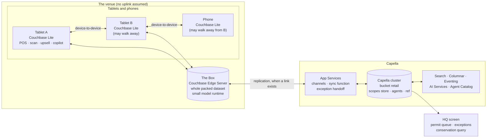
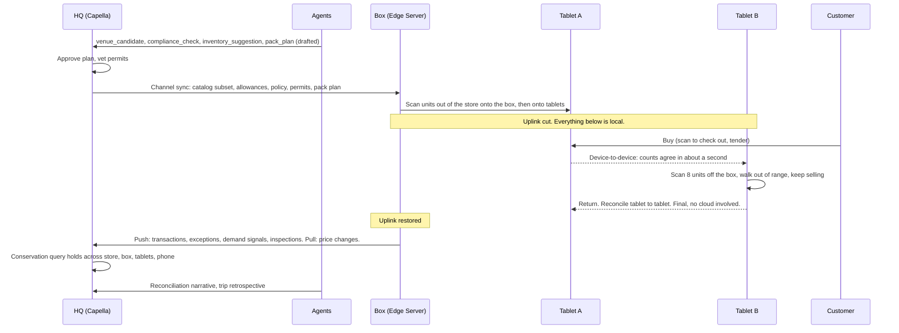

# Store in a Box, architecture overview

Store in a Box is a retail demo. A store packs part of itself into a box (a small server and a few tablets),
sells at a venue with no connectivity, splits into smaller pieces that each keep selling, merges them back
in any order, and rejoins the chain with every unit and every dollar accounted for. Agents in Capella plan
the trip and explain the result; a small model on the box helps the clerk.

Audience for this document: a Couchbase solutions engineer who will present it, and a developer who will
fork it. The product spec is `docs/SPEC.md`; this document is the map from the spec to the components.

## The system

Three tiers, and the demo is about cutting the links between them. Tablets replicate to each other and to
the box with **device-to-device sync**; the box replicates to **Capella App Services** when it has a link;
**Capella** is the system of record and the place the planning agents run. Nothing at the venue ever waits
on the cloud. The cloud is informed, not consulted.

## Data flow: one trip

## Document model

One bucket, `retail`. Three scopes. Same names on the tablet, the box and the cluster.

| Scope.collection | Document | What it is |
|---|---|---|
| `store.product` | `product::<sku>` | Catalog: name, price, images (blobs), category, `embedding[]`. Filtered on the way down: no cost, supplier or margin fields reach the venue |
| `store.allocation` | `allocation::<id>` | **Custody.** `sku`, `qty`, `custodian`, `parent`, `trip`, `status`. Store to box to tablet to phone is a tree of these |
| `store.allowance` | `allowance::<id>` | **Credit as custody.** A loyalty member's reserved offline spend, split and merged like inventory |
| `store.transaction` | `txn::<id>` | Sales and returns. Stamped with custodian, jurisdiction, tax basis, both clocks, and any `upsell_suggestion` with accept/decline |
| `store.customer` | `cust::<id>` | Region-filtered loyalty members, minimal fields, phone hash, encrypted at rest on devices |
| `store.exception` | `exc::<id>` | Oversell, overspend, double-scan, shrinkage, flagged permit. Both sides attached. A human decides |
| `store.demand_signal` | `demand::<id>` | "Asked for, didn't have" with a voice blob; research-agent suggestions; kiosk orders |
| `store.permit` | `permit::<id>` | One per requirement per trip. State machine worked by the agent, the office and the field |
| `store.policy` | `policy::<trip>` | Allowance formula, caps, tender kinds, permit gates, upsell weights. Behaviour the retailer tunes without code |
| `agents.*` | `venue_candidate`, `compliance_check`, `inventory_suggestion`, `pack_plan`, `briefing`, `retrospective`, `eval_run` | Agent inputs and outputs. Every claim carries evidence and a status |
| `ref.ordinance` | `ord::<id>` | Chunked, embedded regulatory text with jurisdiction, source URL, retrieved and last-amended dates |
| `ref.gold_site` | `gold::<id>` | Twenty sites with known-correct compliance answers, for evaluation |

**Why custody and not counts.** Counts merge badly. Two offline decrements of a shared count is the classic
sync failure. Units in custody conserve: a unit is wherever it was last scanned, and the sum over every
custodian at every level is constant. The conservation query is the demo's proof and runs live in Capella.
Custody never conflicts either: every movement is written once and never edited, and two movements of one unit
from the same predecessor are a fork that the ledger, the same rules on every node, turns into an exception with
both sides attached ([conflict-free-ledger](conflict-free-ledger.md)).

## The beats, mapped to components

| Beat | Component | Where it lives |
|---|---|---|
| Place: five candidate venues with reasons | Capella Columnar, Search geo, Agent Catalog | `agents.venue_candidate`, [agents-and-evaluation](agents-and-evaluation.md) |
| Compliance checklist, with proof | Capella Search hybrid retrieval, AI Services, eval harness | [agents-and-evaluation](agents-and-evaluation.md), [permit-flow](permit-flow.md) |
| Pack by scanning | Couchbase Lite writes, App Services channels | [couchbase-lite-custody](couchbase-lite-custody.md), [app-services-sync](app-services-sync.md) |
| Pull the cable, keep selling | Couchbase Lite, device-to-device sync | [couchbase-lite-custody](couchbase-lite-custody.md), [device-to-device-sync](device-to-device-sync.md) |
| Upsell at checkout, offline | Couchbase Lite hybrid search | [hybrid-upsell](hybrid-upsell.md) |
| Loyalty member buys on account, offline | Couchbase Lite encryption, signed QR, allowance custody | [offline-loyalty](offline-loyalty.md) |
| Permit on the tablet, inspection recorded | Blobs, two-way permit state machine | [permit-flow](permit-flow.md) |
| Split the store, merge in any order | Device-to-device sync, custody tree | [device-to-device-sync](device-to-device-sync.md) |
| Plug in: kilobytes, conservation holds | Edge Server to App Services replication, delta sync | [edge-server-box](edge-server-box.md), [capella-reconcile](capella-reconcile.md) |
| Oversell becomes an exception | Conflict-free ledger | [conflict-free-ledger](conflict-free-ledger.md) |
| Retrospective closes the loop | Capella, agents | [capella-reconcile](capella-reconcile.md), [agents-and-evaluation](agents-and-evaluation.md) |

## What the demo proves

- Every node is a store. A tablet that walks away is not a disconnected client; it is a smaller store with
  its own custody, and it reconciles with whatever it meets next.
- Reconciliation is something that happens between any two custodians, not something that happens in the
  cloud. The cloud learns the result.
- Agents propose, humans and rules dispose. The compliance agent proves its claims and never files; the
  packing agent plans and never allocates; the pricing agent suggests and never changes a price.
- Access and scope are properties of the data. The box never holds margin. A revoked tablet empties itself.
- The same platform runs the day at the edge and the planning in the cloud, with documents as the only
  interface between them.

## Talking points

- "Pull the cable. Nothing on this side of the room noticed."
- "Tablet B is not offline from the store. Tablet B *is* a store."
- "The conservation query has the same answer before, during and after, and two of the custodians it sums
  over are out of range right now."
- "Every agent's output is a document with its evidence attached. The next agent reads it. So does the
  auditor."
- "The cloud picks the destination. The edge runs the day."

## Possible enhancements

- Second box with box-to-box custody transfer (same gesture, one level up the tree).
- Pricing proposals inside an HQ band, approved offline on the tablet.
- Customer-facing kiosk with home-delivery orders fulfilled when the box phones home.
- Fleet dispatcher across boxes and weekends.
- Shrinkage patterns across trips, as suggestions with evidence.
- XDCR between regions for a national chain.

## Alternatives and trade-offs

| Approach | What you give up |
|---|---|
| Cloud POS with an offline cache | The cache cannot split, cannot reconcile with a peer, and the "offline" mode is a degraded one. Beats 5, 9 and 10 disappear. |
| REST API plus a local queue | You write checkpoints, retries, conflict handling, partial failure and per-device filtering yourself. The custody model still works, but the sync underneath it is now your product. |
| Count-based inventory with merge rules | Two offline sales of the last unit is a silent loss or a silent oversell. Custody makes it an exception with both sides attached. |
| Agents calling agents over APIs | Nothing runs offline, there is no audit trail without building one, and the on-box agents cannot participate. Documents as the bus make the box a peer. |

Component documents: [couchbase-lite-custody](couchbase-lite-custody.md) ·
[conflict-free-ledger](conflict-free-ledger.md) ·
[device-to-device-sync](device-to-device-sync.md) · [edge-server-box](edge-server-box.md) ·
[app-services-sync](app-services-sync.md) · [capella-reconcile](capella-reconcile.md) ·
[hybrid-upsell](hybrid-upsell.md) · [offline-loyalty](offline-loyalty.md) · [permit-flow](permit-flow.md) ·
[agents-and-evaluation](agents-and-evaluation.md)
