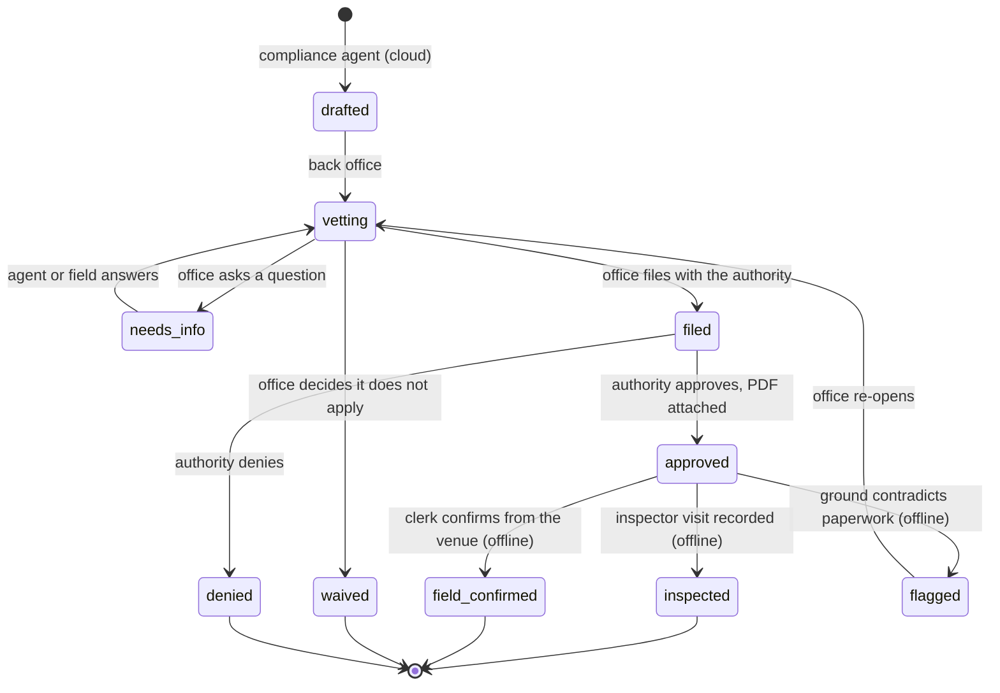

# Permit flow: agent drafts, office vets, field confirms

A permit is one document with a state machine, worked by three parties from wherever they are. The compliance
agent drafts it in Capella. A back office vets it, files it and attaches the approval. The box carries it to the
venue, where the clerk can show it to an inspector, record the inspection, or flag that the ground does not match
the paperwork. Each state change is a write by whoever made it, and it syncs in whichever direction it needs to.

## How Store in a Box uses it

**One document per requirement per trip.** The compliance agent (see
[agents-and-evaluation](agents-and-evaluation.md)) writes a `permit` for each requirement it found: transient
vendor licence, temporary sales tax registration, tent fire inspection, organiser vendor permit. Each carries the
jurisdiction, a reference to the claim in the `compliance_check` that produced it, a `state`, a `history[]` of
every transition with who, when and where (cloud, box or tablet), and `attachments[]` as blobs: the filled
application, the approval, the inspector's signature photo.

**The agent never moves a permit past `drafted`.** Everything from `vetting` onward is a human in the back office
or the authority itself. This is the fencing rule from the spec applied where it matters most, and the HQ screen
for this is one queue with three buttons. The demo says, once, that there is no code path for an agent to approve
anything.

**Cloud to edge.** When the office attaches an approval, the `permit` changes in Capella and reaches the box through
the trip channel on the next sync. The compliance viewer on every tablet shows each requirement with its state and
the approval PDF if there is one. It is on the tablet when the fire marshal walks up, with the cable out, because
it arrived before the cable came out.

**Edge to cloud.** The field writes three things back, all offline:

- `field_confirmed`: the clerk called the county from the parking lot about a `needs_confirmation` claim. The
  answer in the note becomes a `confirmation` source document the compliance agent reads on its next run, so the
  knowledge base improves per trip.
- `inspected`: who came, when, the outcome, a photo of what they signed, as a blob.
- `flagged`: the organiser moved the booth into a different fire zone, or the tent is bigger than the permit says.
  The office sees it when the box next phones home and re-opens the permit.

**Gating.** The trip's `policy` document says what the box may do in each permit state. A venue whose tax
registration is still `drafted` or came back `denied` can be configured to block `account` tender, or block selling
entirely, or warn and proceed. The gate is a policy value, not code. The demo flips one from HQ and shows the
tablet honour it after the next sync, with the permit state named as the reason. See
[offline-loyalty](offline-loyalty.md) for the tender it most often gates.

**Needs-info routing.** A question from the office is routed either back to the agent (re-run with the question
as context) or to the field (it appears on the tablet's compliance viewer as something to confirm on site). Who
answers is recorded in `history[]`.

**What the office does not do from here.** It does not contact the inspector or the authority through the system.
Outbound contact with a government body is a human act with a human name on it; the document records that it
happened, and that is the right boundary for a demo and probably for a product.

## Talking points

- "The agent drafted this permit. Everything after that line was a person."
- "The approval was attached in the office this morning. It is on the tablet now, and the tablet has no signal."
- "The inspector signed. The clerk took a photo. The office will see it when the box gets home."
- "No account tender until the tax registration is approved. That is a policy value we flipped from HQ, and the
  tablet enforced it a minute later."
- "What the field learns goes back as a source. Next trip to this city, the agent already knows."

## Possible enhancements

- Deadline awareness: `due` dates on `filed` permits raise a morning question for the office when lead time is
  running out against the trip date.
- Permit templates per jurisdiction that the agent fills, replacing a free-form application attachment.
- Inspector-facing read-only view on the tablet, so the clerk hands the device over rather than narrating.
- Expiry tracking so a multi-event licence is reused across trips and renewed in time.

## Alternatives and trade-offs

| Option | Trade-off |
|---|---|
| **Agent files the permits** | The tempting ending, and the one that costs trust. A wrongly filed permit is a legal act in the retailer's name. Drafting is as far as an agent should go. |
| **Permits in a separate workflow tool** | The approval is not on the tablet when the inspector arrives, and the inspection does not reach the office without someone retyping it. |
| **A PDF folder on the box** | Works for showing the permit. Nothing flows back, nothing gates tender, and nobody knows which requirement is still open. |
| **Email between office and field** | It is what happens today. It is also why the box has no idea whether it may sell. |

Related: [agents-and-evaluation](agents-and-evaluation.md) · [app-services-sync](app-services-sync.md) ·
[offline-loyalty](offline-loyalty.md) · [edge-server-box](edge-server-box.md)
